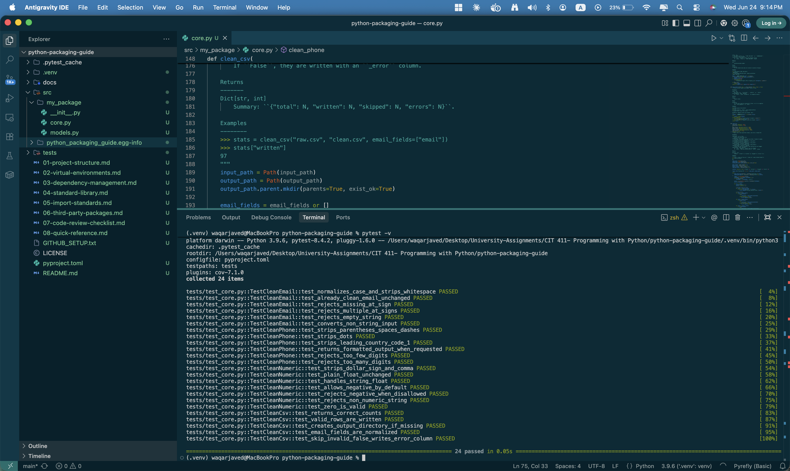

# 🐍 Python Project Structure & Packaging — The Complete Guide

> **Everything you need to structure, package, and ship professional Python projects.**
> Built for developers who want to do things right from day one — not fix a mess six months later.

---

## 👋 Who This Is For

You're writing Python and you've hit one of these moments:

- _"Where should I put this file?"_
- _"Why does `import mypackage` work from some directories but not others?"_
- _"What even goes in `pyproject.toml`?"_
- _"My teammate can't run my code after cloning it. Why?"_

This guide answers all of them. It covers the **professional standard** used by production engineering teams — the same decisions you'll encounter in serious open-source projects and companies that care about reproducibility.

---

## 🗺️ How to Read This Guide

Each topic is its own file. Read them in order the first time. After that, use them as a reference.

| # | Topic | What you'll learn |
|---|---|---|
| [01](docs/01-project-structure.md) | **Project Structure** | The `src/` layout, directory roles, `pyproject.toml` |
| [02](docs/02-virtual-environments.md) | **Virtual Environments** | Why, how, and the `.gitignore` you must have |
| [03](docs/03-dependency-management.md) | **Dependency Management** | Pinned vs ranges, two-file system, security |
| [04](docs/04-standard-library.md) | **Standard Library Guide** | 10 modules every Python dev must know |
| [05](docs/05-import-standards.md) | **Import Standards** | Order, absolute vs relative, the wildcard ban |
| [06](docs/06-third-party-packages.md) | **Third-Party Packages** | Adding deps safely, PyPI policy, approved list |
| [07](docs/07-code-review-checklist.md) | **Code Review Checklist** | 10 questions, instant-rejection conditions |
| [08](docs/08-quick-reference.md) | **Quick Reference** | One-page cheat sheet for daily use |

---

## ⚡ The 60-Second Version

If you only read one thing, read this:

```
Every Python project:
  ✅ Uses the src/ layout
  ✅ Has its own .venv (never committed)
  ✅ Is installable with: pip install -e ".[dev]"
  ✅ Has a pyproject.toml as its single source of truth
  ✅ Uses absolute imports
  ✅ Never uses: from x import *
  ✅ Pins deps in requirements.txt, ranges in pyproject.toml
```

---

## 🏗️ The Canonical Project Layout

Every project starts from this template. Everything has a reason.

```
my-project/
│
├── src/                          ← ALL importable code lives here
│   └── my_package/
│       ├── __init__.py           ← public API, version, docstring
│       ├── core.py               ← primary business logic
│       ├── utils.py              ← shared helpers
│       └── models.py             ← data models / schemas
│
├── tests/                        ← ALL tests; mirrors src/ structure
│   ├── conftest.py               ← shared fixtures
│   ├── test_core.py
│   ├── test_utils.py
│   └── integration/
│       └── test_end_to_end.py
│
├── docs/                         ← documentation source (MkDocs)
│   └── index.md
│
├── data/
│   ├── raw/                      ← read-only source data
│   ├── processed/                ← pipeline outputs (.gitignore'd if large)
│   └── fixtures/                 ← small test data (committed)
│
├── scripts/                      ← one-off ops scripts; never imported
│
├── .venv/                        ← virtual environment (NEVER commit this)
├── .gitignore                    ← must include .venv/, __pycache__/, dist/
├── .python-version               ← pins Python version for pyenv
├── pyproject.toml                ← single source of truth
├── requirements.txt              ← pinned runtime deps (generated)
├── requirements-dev.txt          ← pinned dev deps (generated)
└── README.md                     ← setup instructions + project purpose
```

A working example of this layout lives in [`examples/my_project/`](examples/my_project/).

---

## 🚀 Quick Start (Clone This Repo and Explore)

```bash
git clone https://github.com/iamwaqarjaved/python-packaging-guide.git
cd python-packaging-guide

# Create virtual environment and install
python -m venv .venv
source .venv/bin/activate      # Windows: .venv\Scripts\activate
pip install -e ".[dev]"

# Run the test suite
pytest -v
```

---

## ✅ Test Results — 24 Passed

All 24 tests pass on Python 3.9+ with full coverage across `clean_email`, `clean_phone`, `clean_numeric`, and the `clean_csv` pipeline:



---

## 📋 The Non-Negotiables

These rules are enforced in code review. Violations are instant rejection:

| Rule | Why |
|---|---|
| No `.venv/` in git | Platform-specific binaries; regeneratable in seconds |
| No `from x import *` | Namespace pollution; tool blindness; review opacity |
| No hardcoded paths | Breaks on every machine except yours |
| No `print()` in library code | Use `logging`; callers control output |
| No flat layout (no `src/`) | Causes silent import bugs in production |

---

## 🗂️ Example Project

This repo **is** the working example. The `src/`, `tests/`, and `pyproject.toml` at the root demonstrate every standard in this guide:

- [`src/my_package/core.py`](src/my_package/core.py) — `clean_email`, `clean_phone`, `clean_numeric`, `clean_csv`
- [`tests/test_core.py`](tests/test_core.py) — 24 tests across 4 test classes
- [`tests/conftest.py`](tests/conftest.py) — shared `sample_csv` fixture
- [`pyproject.toml`](pyproject.toml) — complete build config and tool settings

---

## 📖 Continue Reading

**Start here:** [01 — Project Structure →](docs/01-project-structure.md)

---

*Author: [Waqar Javed](https://waqarjaved.com)*
*This guide is open-source. PRs welcome.*